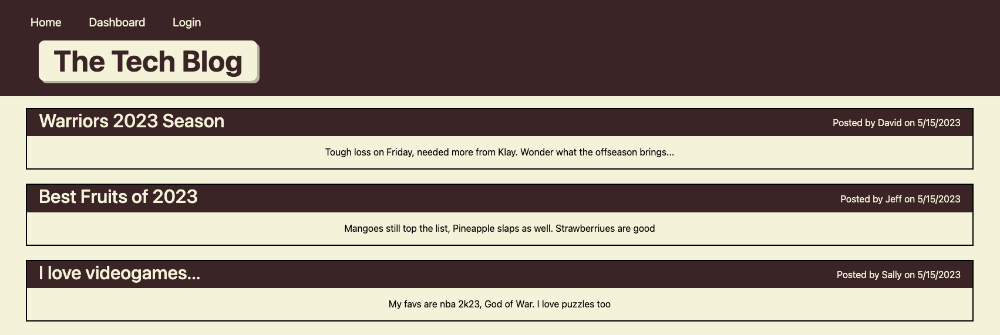

# tech-blog

## Description

This application is a website for viewing, posting, and interacting with blogs of any topic. Users are able to create an account, post their own blogs, and comment on any posted blogs from other users. 

Building this app gave me valuable experience with creating a full-stack backend application combining node js, express js and handlebars js, along with a mysql database.

## Installation

No Installation required.

## Usage

Click this [link](https://safe-stream-47655.herokuapp.com/) to open the webpage. 

Upon loading you will be met with a landing page that contains all created blogposts, if any exist. It should look like the screenshot below.

Click the login page to login. Login with your credentials or click "sign Up" to create an account. After you sign up navigate back to the homepage and click on any of the posts to leave a comment. 

Head over to dashboard to see your created posts, add a post, or delete a post. Click on any existing posts in your dashboard to delete them.

